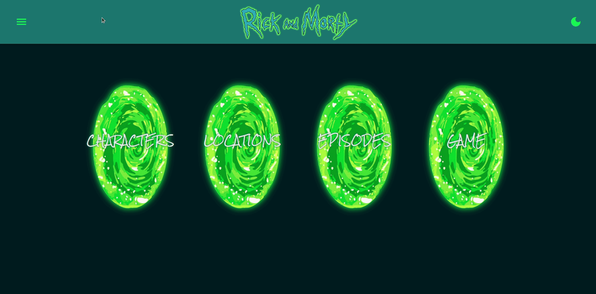
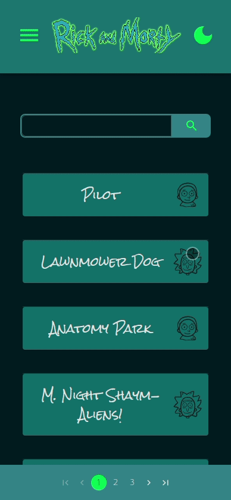
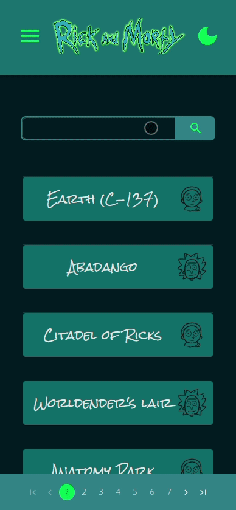
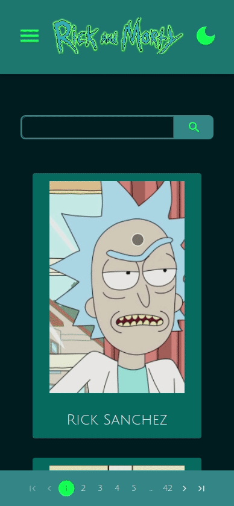
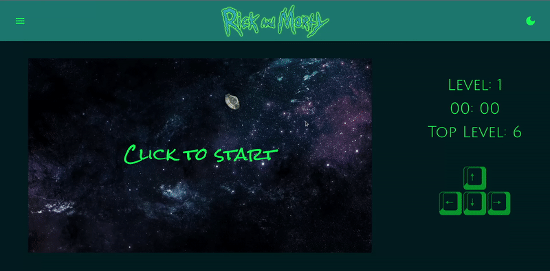
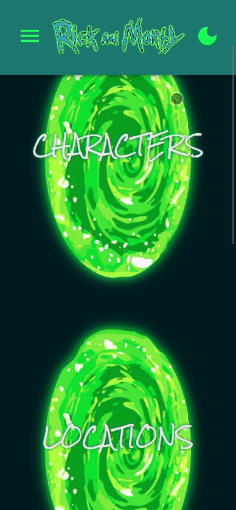

# [Visite this application](https://rick-and-morty-gonzagadavid.vercel.app/)

# Summary
- [Introduction](#introduction)
- [Pages](#pages)
  - [Home](#home)
  - [Characters](#characters)
  - [Episodes](#episodes)
  - [Locations](#locations)
  - [Character](#character)
- [API](#API)
- [Tecnologies](#tecnologies)
- [Work in progress](#work-in-progress)
- [Game](#game)

# Intoduction

Rick and Morty application with information and game this animation fun, developed to practice React TS, Material UI, Apollo GraphQL client side

# Pages

## Home

The initial page contains portals to the application pages

 
 

## Characters 

This page contains cards with image and name of all characters, when clicking on the card will redirect you to a Character page with details of this character

 
 

## Episodes

This page contains episodes info and participating characters, when clicking on the card will redirect you to a [Character](#character) page with details of this character

 
 

## Locations 

Contains characteristics of animation locations, and characters from this, when clicking on the card will redirected you to [Character](#character) page with details of this character

 
 

## Character

This page contains character details

 
 

## Game

Run away from the space snake, don't let it bite Morty

 

# API

This project use the amazing [Rock and Morty API](https://rickandmortyapi.com/)

# Tecnologies

- React
- Typescript
- Graphql
- Apollo Graphql
- React Router
- Material UI
- ESLint  
  

   
  &nbsp;&nbsp;&nbsp;
  
  &nbsp;&nbsp;&nbsp;
  
  &nbsp;&nbsp;&nbsp;
  
  &nbsp;&nbsp;&nbsp;
  
  &nbsp;&nbsp;&nbsp;
  
  &nbsp;&nbsp;&nbsp;
  

# Deploy

Deployment in [Vercel](https://vercel.com/) 

# Work in progress

- Automated Tests
